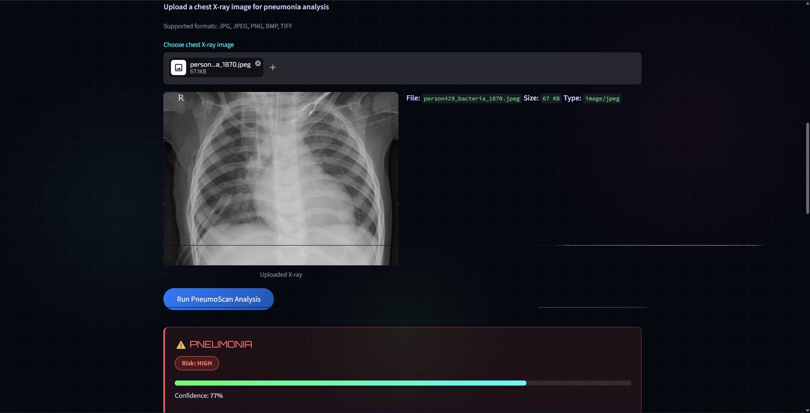
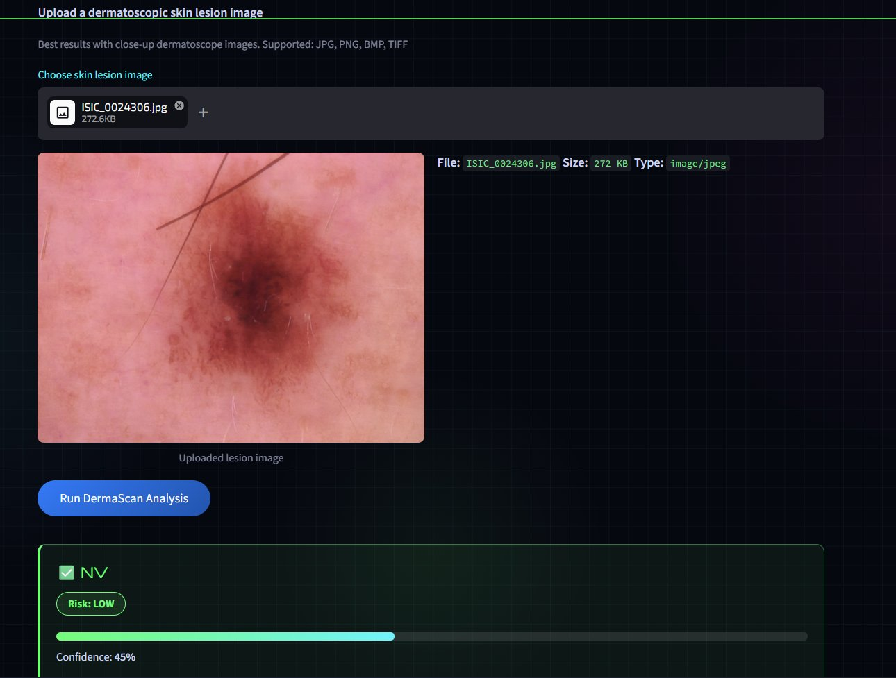
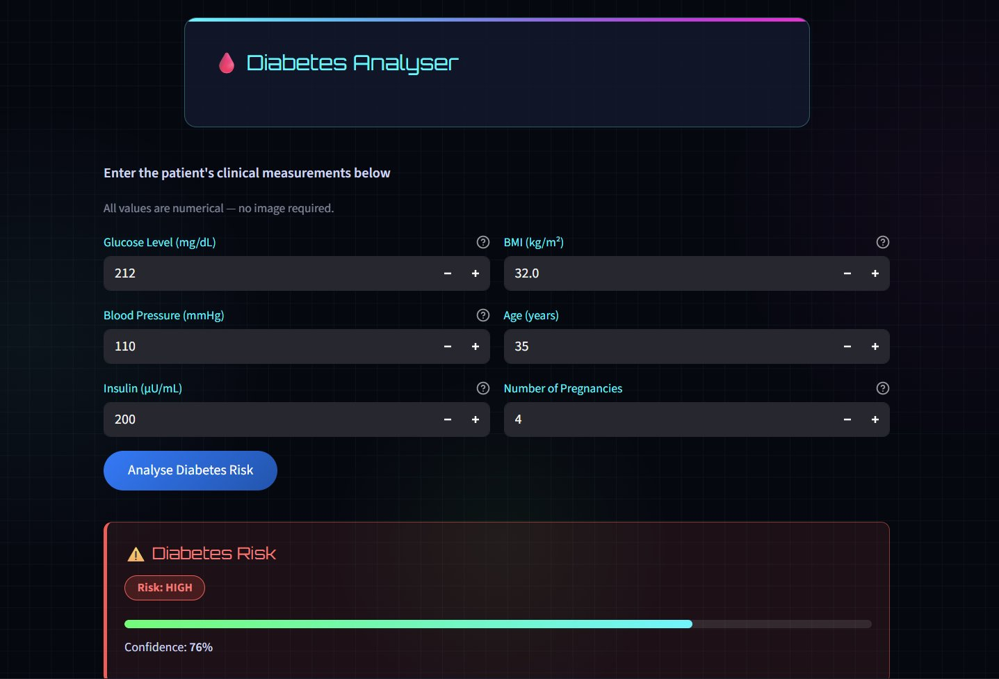
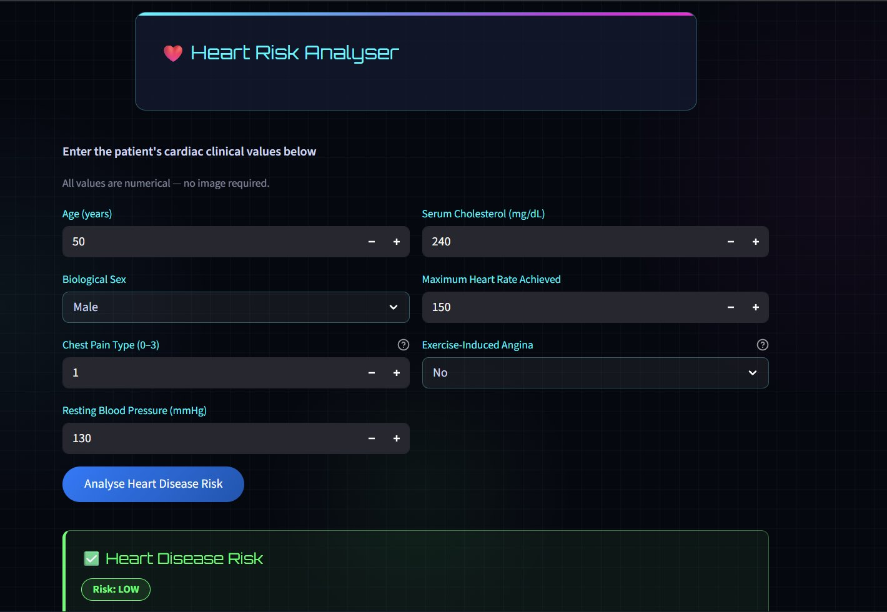

# 🧬 ArogyaAI — AI-Powered Clinical Decision Support System

> **⚠️ Disclaimer:** ArogyaAI is a research and educational prototype. It is **not** a certified medical device and must never be used as the sole basis for clinical decisions, diagnosis, or treatment. Always consult a licensed healthcare professional.

---

## 📌 Overview

ArogyaAI is an end-to-end AI-powered clinical decision support system developed as part of a Machine Learning & MLOps project at **UIET, Panjab University, Chandigarh**. It integrates four disease detection modules into a single unified web application with a cyberpunk-themed Streamlit frontend and a Flask REST API backend.

| Module | Type | Model |
|---|---|---|
| 🫁 **PneumoScan** | Chest X-Ray Image | MobileNetV2 (Transfer Learning) |
| 🔬 **DermaScan** | Skin Lesion Image | MobileNetV2 (Transfer Learning) |
| 💉 **Diabetes Analyser** | Tabular / Numerical | Gradient Boosting Classifier |
| ❤️ **Heart Risk Analyser** | Tabular / Numerical | Gradient Boosting Classifier |

---

## 📸 Screenshots

### 🫁 PneumoScan — Chest X-Ray Analysis


### 🔬 DermaScan — Skin Lesion Detection


### 💉 Diabetes Analyser


### ❤️ Heart Risk Analyser


---

## 🏗️ Architecture

```
┌─────────────────────────────────┐       ┌──────────────────────────────────┐
│   Streamlit Frontend            │       │   Flask REST API                 │
│   streamlit_app.py              │──────▶│   app.py  (port 5050)            │
│   port 8501                     │       │                                  │
│                                 │       │  /api/predict/pneumonia  (image) │
│  • PneumoScan tab               │       │  /api/predict/skin       (image) │
│  • DermaScan tab                │       │  /api/predict/diabetes   (JSON)  │
│  • Diabetes Analyser tab        │       │  /api/predict/heart      (JSON)  │
│  • Heart Risk Analyser tab      │       │  /api/status                     │
└─────────────────────────────────┘       └──────────────────────────────────┘
```

---

## 📁 Project Structure

```
ArogyaAI/
│
├── app.py                        # Flask REST API — model training & inference
├── streamlit_app.py              # Streamlit frontend UI
├── pretrain.py                   # One-time script: trains & saves CNN models
├── prepare_skin_dataset.py       # Organises HAM10000 images into class folders
│
├── screenshots/                  # UI screenshots for README
│   ├── pneumoscan.png
│   ├── dermascan.png
│   ├── diabetes_analyser.png
│   └── heart_analyser.png
│
├── datasets/                     # Download separately from Kaggle (gitignored)
│   ├── diabetes/
│   │   └── diabetes.csv
│   ├── heart/
│   │   └── heart_cleveland_upload.csv
│   ├── pneumonia/
│   │   └── train/
│   │       ├── NORMAL/
│   │       └── PNEUMONIA/
│   └── skin/
│       ├── HAM10000_metadata.csv
│       ├── HAM10000_images_part_1/
│       ├── HAM10000_images_part_2/
│       └── train/                # Generated by prepare_skin_dataset.py
│           ├── akiec/ bcc/ bkl/ df/ mel/ nv/ vasc/
│
├── pneumonia_mobilenet.keras     # Saved pneumonia model (generated, gitignored)
├── skin_mobilenet.keras          # Saved skin model (generated, gitignored)
├── skin_mobilenet_classes.json   # Skin class labels (generated, gitignored)
│
└── requirements.txt
```

---

## 🗃️ Datasets

Download the following datasets from Kaggle and place them in the `datasets/` folder.

| Dataset | Source | Place at |
|---|---|---|
| Chest X-Ray Images (Pneumonia) | [Kaggle – Paul Mooney](https://www.kaggle.com/datasets/paultimothymooney/chest-xray-pneumonia) | `datasets/pneumonia/train/` |
| Skin Cancer MNIST: HAM10000 | [Kaggle – ISIC Archive](https://www.kaggle.com/datasets/kmader/skin-cancer-mnist-ham10000) | `datasets/skin/` |
| Pima Indians Diabetes Database | [Kaggle – UCI](https://www.kaggle.com/datasets/uciml/pima-indians-diabetes-database) | `datasets/diabetes/diabetes.csv` |
| Heart Disease (Cleveland) | [Kaggle – UCI](https://www.kaggle.com/datasets/cherngs/heart-disease-cleveland-uci) | `datasets/heart/heart_cleveland_upload.csv` |

> **Note:** The `datasets/` folder is gitignored. Do not commit raw data to the repository.

---

## ⚙️ Tech Stack

- **Python 3.12**
- **Flask 3.x** — REST API backend
- **Streamlit** — Interactive web UI
- **TensorFlow / Keras** — MobileNetV2 transfer learning for image models
- **Scikit-learn** — Gradient Boosting pipelines for tabular models
- **Pillow** — Image preprocessing
- **NumPy / Pandas** — Data handling
- **Flask-CORS** — Cross-origin support

---

## 🚀 Getting Started

### 1. Clone the repository

```bash
git clone https://github.com/<your-username>/ArogyaAI.git
cd ArogyaAI
```

### 2. Create a virtual environment

```bash
python -m venv venv

# Mac/Linux
source venv/bin/activate

# Windows
venv\Scripts\activate
```

### 3. Install dependencies

```bash
pip install -r requirements.txt
```

### 4. Download datasets

Download all four datasets from Kaggle (links above) and place them in the `datasets/` directory as shown in the project structure.

### 5. Prepare the skin dataset

Reorganises HAM10000 images into per-class subfolders required for training:

```bash
python prepare_skin_dataset.py
```

### 6. Train the models (first run only)

```bash
python app.py
```

Training takes 20–40 minutes depending on your hardware. When complete you will see:

```
Pneumonia model saved → pneumonia_mobilenet.keras
Skin model saved → skin_mobilenet.keras
Models ready: ['diabetes', 'heart', 'pneumonia', 'skin']
```

> After first successful training, the `.keras` files are saved to disk. Every future restart loads them instantly — no retraining needed.

### 7. Run the application

Open **two terminals**:

**Terminal 1 — Flask API:**
```bash
python app.py
```

**Terminal 2 — Streamlit frontend:**
```bash
streamlit run streamlit_app.py
```

Open your browser at: **http://localhost:8501**

---

## 🔄 Retraining

If you ever need to retrain the image models from scratch (e.g. after adding more data), simply delete the saved model files and restart:

```bash
# Always delete both files together
rm pneumonia_mobilenet.keras
rm skin_mobilenet.keras
rm skin_mobilenet_classes.json

python app.py   # retrains automatically
```

> **Never set `FORCE_RETRAIN = True` permanently in `app.py`.** It is only meant for a one-time cleanup of old files. Leaving it `True` will delete your saved model on every restart and force a full retrain every time.

---

## 🔌 API Reference

Base URL: `http://localhost:5050`

| Endpoint | Method | Input | Output |
|---|---|---|---|
| `/api/status` | GET | — | Loaded and missing models |
| `/api/predict/pneumonia` | POST | `multipart/form-data` image | `label`, `probability`, `risk_level`, `all_probs` |
| `/api/predict/skin` | POST | `multipart/form-data` image | `label`, `probability`, `risk_level`, `all_probs` |
| `/api/predict/diabetes` | POST | JSON body | `label`, `probability`, `risk_level` |
| `/api/predict/heart` | POST | JSON body | `label`, `probability`, `risk_level` |

**Diabetes JSON fields:** `pregnancies`, `glucose`, `bp`, `insulin`, `bmi`, `age`

**Heart JSON fields:** `age`, `sex` (`"male"`/`"female"`), `cp` (0–3), `trestbps`, `chol`, `thalach`, `exang` (`"yes"`/`"no"`)

**Risk levels:** `LOW` | `MODERATE` | `HIGH`

### Example request

```bash
curl -X POST http://localhost:5050/api/predict/diabetes \
  -H "Content-Type: application/json" \
  -d '{"pregnancies": 2, "glucose": 138, "bp": 70, "insulin": 0, "bmi": 33.6, "age": 45}'
```

Response:
```json
{
  "label": "Diabetes Risk",
  "probability": 0.7241,
  "risk_level": "HIGH"
}
```

---

## 🤖 Model Details

### Image Models (MobileNetV2 Transfer Learning)

- **Backbone:** MobileNetV2 pre-trained on ImageNet — 3.4M parameters
- **Why MobileNetV2 over ResNet50:** 7× fewer parameters means far less overfitting on small medical datasets (≤2000 samples per class). ResNet50 consistently produced degenerate predictions on this data size; MobileNetV2 converges reliably
- **Training strategy:** Two-phase — backbone frozen with head trained at LR 1e-3, then top 30 layers unfrozen and fine-tuned at LR 1e-5
- **Augmentation:** Random flips, rotation ±15°, zoom ±15°, brightness and contrast variation via `tf.data` pipeline (training only)
- **Class balancing:** `compute_class_weight` from sklearn + random oversampling for minority classes
- **Model persistence:** Models are always saved after training completes regardless of validation accuracy. A low-accuracy model is always better than a 503 error

### Tabular Models (Gradient Boosting)

- **Algorithm:** `GradientBoostingClassifier` with `StandardScaler` pipeline
- **Hyperparameters:** 400 estimators, learning rate 0.05, max depth 4, subsample 0.8

### Skin Cancer Classes (HAM10000)

| Code | Condition | Risk |
|---|---|---|
| `mel` | Melanoma | 🔴 HIGH |
| `bcc` | Basal Cell Carcinoma | 🔴 HIGH |
| `akiec` | Actinic Keratosis / Intraepithelial Carcinoma | 🟡 MODERATE |
| `bkl` | Benign Keratosis | 🟡 MODERATE |
| `df` | Dermatofibroma | 🟢 LOW |
| `nv` | Melanocytic Nevi | 🟢 LOW |
| `vasc` | Vascular Lesion | 🟢 LOW |

---

## 🛠️ Troubleshooting

**503 on `/api/predict/skin` or `/api/predict/pneumonia`**

The model file is missing or failed to load. Check terminal logs. Then delete the `.keras` files and retrain:
```bash
rm skin_mobilenet.keras skin_mobilenet_classes.json
python app.py
```

**Model always predicts the same class regardless of image**

Old `.keras` files from a broken training run are cached. Delete them and retrain:
```bash
rm pneumonia_mobilenet.keras skin_mobilenet.keras skin_mobilenet_classes.json
python app.py
```

**Training is very slow**

Verify TensorFlow can see your GPU:
```python
import tensorflow as tf
print(tf.config.list_physical_devices('GPU'))
```

---

## 📋 requirements.txt

```
flask
flask-cors
streamlit
tensorflow
scikit-learn
pillow
numpy
pandas
requests
```

---

## ⚠️ Important Cautions

- **Not a Medical Device** — This project has not been clinically validated, has not received regulatory approval (CDSCO / FDA / CE), and must never substitute professional medical judgment.
- **Dataset Limitations** — Models trained on public Kaggle datasets may not generalise to all patient populations or imaging equipment.
- **Image Quality Dependency** — PneumoScan and DermaScan require properly acquired medical images. Poor lighting or low resolution will produce unreliable results.
- **No Data Storage** — No patient data or uploaded images are stored. All processing happens in-memory per request.

---

## 👤 Author

**Saksham Ohlyan**
UIET — University Institute of Engineering & Technology
Panjab University, Chandigarh

---

## 📄 License

This project is for **research and educational purposes only**.

---

*© 2025 Saksham Ohlyan — ArogyaAI | Advanced Disease Detection System*
